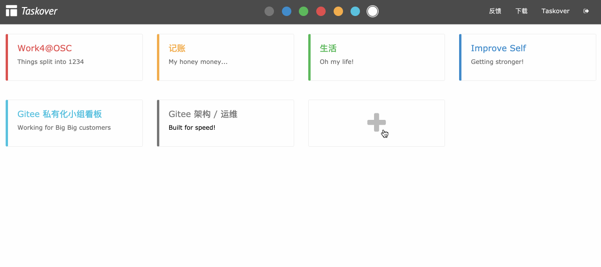
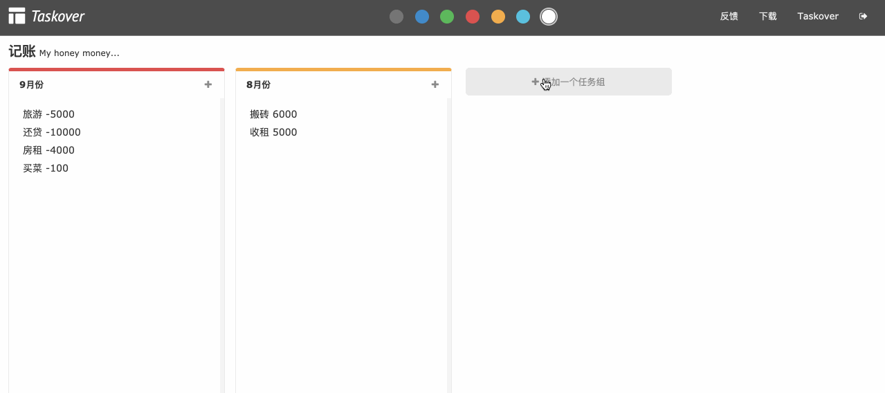
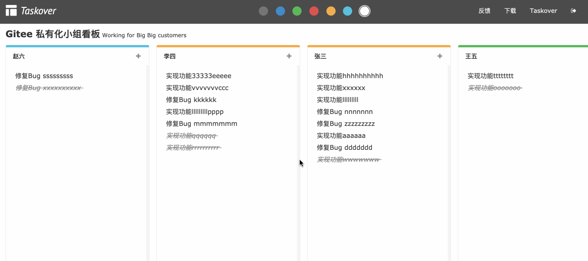

### Taskover 开源个人任务管理工具

项目是基于`Rails+VueJs`的一款开源个人任务管理工具，通过简单易用的任务归纳分类方式，用来帮助您高效的追踪管理各项任务，最大化的提升工作效率。

这个是学习`VueJs`时的一个 Demo 项目，后来发现管理个人任务挺好用，本着强迫症患者该有的精神，就美化了下界面，设计了个 Logo，然后放出来了，项目很简单，适合`Rails`以及`Vue`初学者学习使用。

> 源码下载 https://gitee.com/kesin/taskover
>
> 在线演示 http://taskover.zoker.io/ 账号 demo / 111111

#### 功能

- 快速创建计划分类
- 快速创建列表
- 快速创建、编辑、删除、结束、重开任务
- 通过颜色标签快速筛选
- Plan/List/Task 均支持拖拽排序

#### 功能截图
##### 首页

##### 简易方便的任务分类（Plan）

##### 简单易用的任务分组（List）

##### 简单高效的任务管理（Task）

#### 使用

项目基于 `Ruby 2.3.1` 及以上

1. git clone https://gitee.com/kesin/taskover
2. bundle install
3. cp database.yml.example database.yml  #修改数据库配置
4. cp puma.rb.example puma.rb
5. cd taskover
6. bundle exec rake db:migrate
7. cp development.rb.example development.rb
8. bundle exec puma

访问 http://127.0.0.1:3001

#### 在线演示

- 演示地址： http://115.28.75.212/
- 演示账号： demo / 111111

#### 贡献代码

1. Fork 项目
2. 创建本地分支 (`git checkout -b my-new-feature`)
3. 提交更改 (`git commit -am 'Add some feature'`)
4. 推送到分支 (`git push origin my-new-feature`)
5. 创建一个 Pull Request

#### 贡献者

[@Zoker](https://zoker.io)

[@Frech](https://gitee.com/frech)
